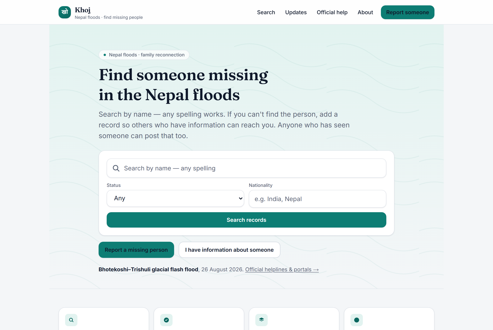
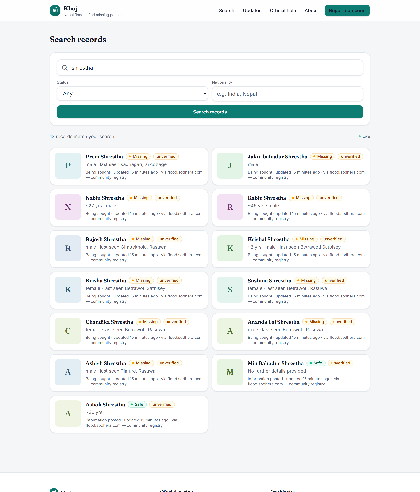
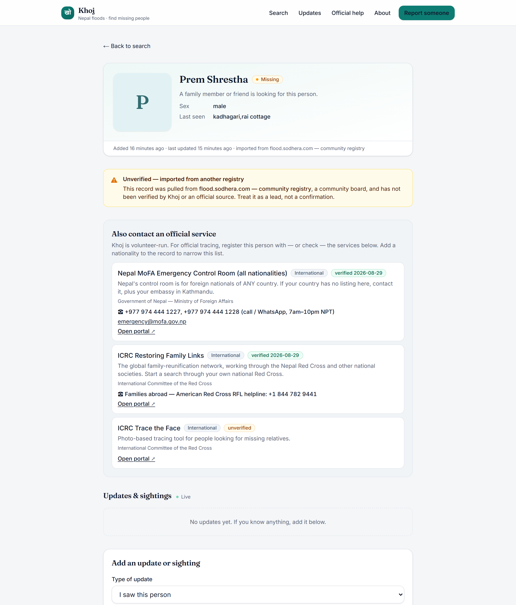
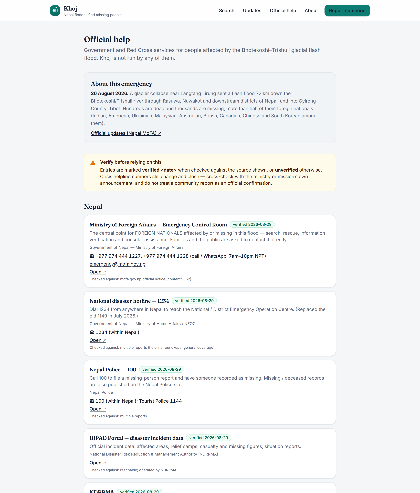
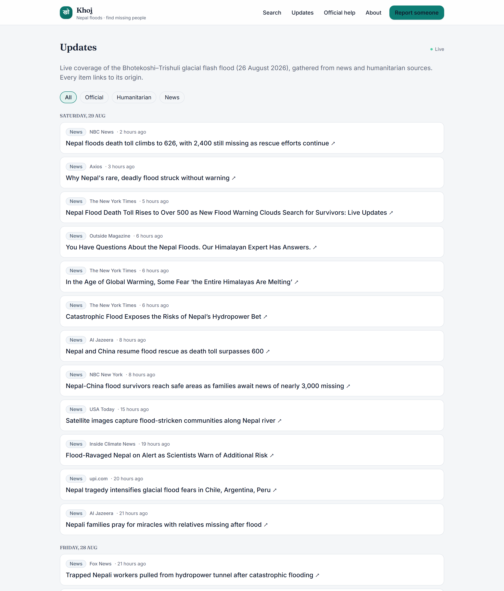
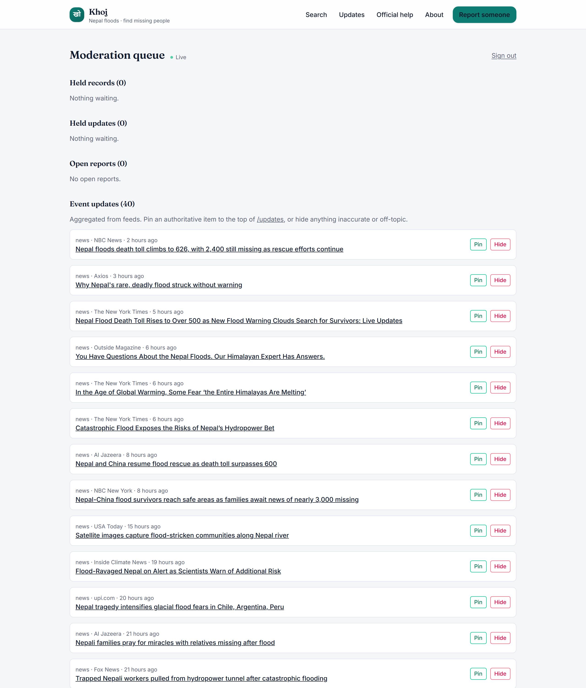
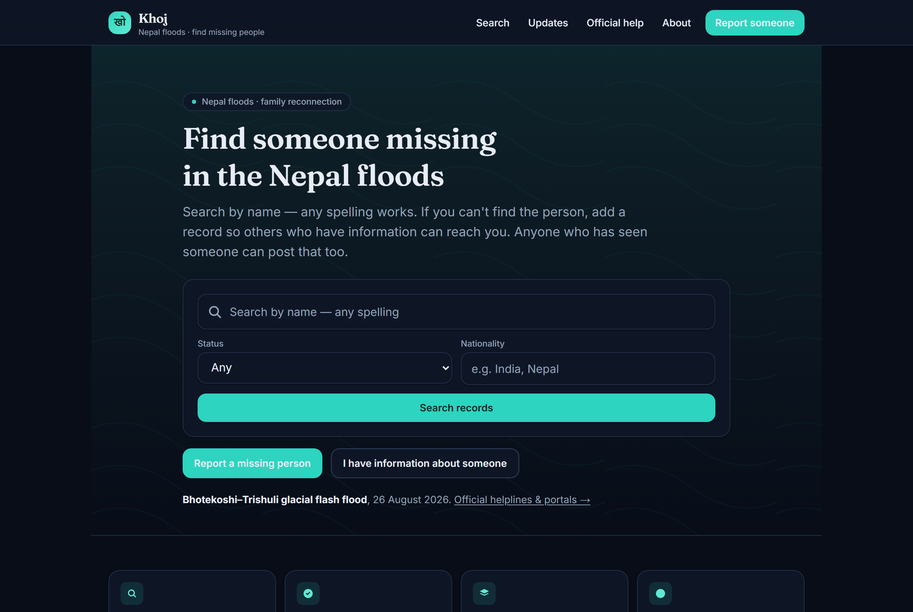
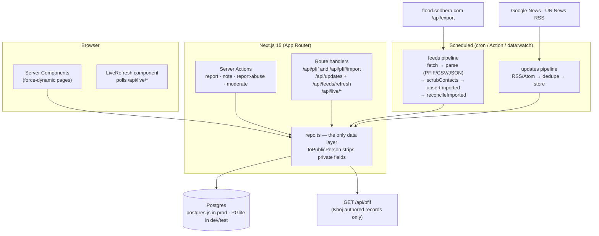

# Khoj — a missing-persons finder for the Nepal floods

Khoj (*खोज*, "search") is a volunteer-style board for reconnecting families
separated by the **August 2026 Bhotekoshi–Trishuli glacial flash flood**. People
**report a missing person**, **post a sighting or status update**, and **search**
records by name in any spelling. It aggregates official helplines and live news
for the event, and syncs records with a peer registry over the **PFIF**
standard.

<p>
  <a href="https://github.com/aman-singh01/khoj-nepal-floods/actions/workflows/ci.yml"></a>
  
  
  
</p>

> **Not an official service.** It's a portfolio build modelled on a real event.
> For formal tracing, use the [ICRC Restoring Family
> Links](https://familylinks.icrc.org/) network and the Nepal Red Cross Society.
> Person records shown in screenshots are imported from a peer registry and
> marked unverified.



---

## The problem

When a disaster separates families across borders, the information is scattered:
a government portal has aggregate counts, the Red Cross runs access-controlled
tracing, news names some of the missing, and volunteers stand up ad-hoc boards.
No single source is complete, and each isolated board helps fewer families than
two that share data. Khoj is a board that is **built to interoperate** — and to
do it without leaking the personal data of people who are already in a crisis.

## What it does

| Area | Detail |
| --- | --- |
| **Two record types** | "I'm looking for someone" / "I have information about someone", mirroring Google Person Finder. A published status update moves the person's headline status; the record page keeps a running sighting timeline. |
| **Fuzzy name search** | Transliteration- and typo-tolerant — "arati shresta" finds "Aarati Shrestha". Candidate retrieval in SQL, ranking (trigram Dice + token containment) in the app, so **no Postgres extension is required** ([ADR-0004](docs/decisions/0004-in-app-fuzzy-name-matching.md)). |
| **Privacy by design** | Submitter phone/email are never shown publicly or exported — contact is mediated through a moderator. IPs are stored only as salted hashes. Imported free text is scrubbed of phone numbers, emails, passport/ID numbers and DOB. |
| **Anti-abuse** | Per-IP rate limiting, a honeypot field, automatic hold of records mentioning payment/money, a "report this record" button, auto-hold after repeated reports. |
| **Live updates** | Record pages, the home feed + counters, search, the news stream and the moderation queue refresh themselves — each polls a tiny `/api/live/*` version endpoint and re-fetches the server render on a change ([ADR-0003](docs/decisions/0003-polling-not-websockets.md)). |
| **Official-services directory** | `/official` + a per-record panel filtered by nationality (Nepal / India / US / any). Ships with **web-verified** helplines for this event — Nepal MoFA Emergency Control Room, the `1234` / `100` lines, India's MEA control room + Embassy of India Kathmandu, American Red Cross RFL — each stamped `verified <date>` with the source it was checked against. |
| **Event news stream** | `/updates` aggregates Google News + UN News RSS (ReliefWeb when an `appname` is registered), deduped by URL, tagged `official` / `humanitarian` / `news`, each linking to its origin. Moderators pin or hide items. |
| **PFIF interop** | `GET /api/pfif` exports Khoj-authored records as [PFIF 1.4](https://zesty.ca/pfif/1.4/) (`?since=` deltas). `POST /api/pfif/import` ingests PFIF / CSV / JSON. Imported records carry their source's verification status, are attributed "via …", upsert idempotently, and are excluded from re-export so data can't loop ([ADR-0001](docs/decisions/0001-pfif-as-interchange-format.md), [ADR-0005](docs/decisions/0005-importing-community-data-as-unverified.md)). |
| **Feed reconciliation** | When an imported record disappears from its source feed: grace period → held for a moderator after 24h → auto-restored if it returns. A truncated/failed feed is detected and skipped, so records aren't swept away ([ADR-0006](docs/decisions/0006-feed-reconciliation.md)). |
| **Moderation** | `/moderation` queue (token-gated) — publish/hide held records, resolve reports, pin/hide news, review records that left a feed. |
| **Data retention** | Records carry `expires_at` (default 180 days) and can be removed from the device that created them. |
| **Accessibility** | Labelled controls, visible focus, reduced-motion support, theme-aware light/dark, search works without JavaScript. |

## Screenshots

| Search — fuzzy match + imported-record provenance | Record page |
| --- | --- |
| [](docs/screenshots/search.png) | [](docs/screenshots/record.png) |

| Official help — web-verified helplines | Live event news |
| --- | --- |
| [](docs/screenshots/official.png) | [](docs/screenshots/updates.png) |

| Moderation queue | Home (dark) |
| --- | --- |
| [](docs/screenshots/moderation.png) | [](docs/screenshots/home-dark.png) |

*Regenerate with `npm run shots` while the app is running.*

## Architecture



- **Server-first.** Pages are RSC + Server Actions; almost no client JS beyond
  the small `<LiveRefresh>` poller and a few `useActionState` forms.
- **One data layer.** Everything goes through `src/lib/repo.ts`;
  `toPublicPerson` / `toPublicNote` are the single choke point that strips
  private fields before anything reaches a browser or an export.
- **Lazy dual-driver DB.** `getDb()` picks postgres.js or PGlite from
  `DATABASE_URL` and is never called at build time
  ([ADR-0002](docs/decisions/0002-dual-database-driver.md)).

## Engineering decisions

Short ADRs in [`docs/decisions/`](docs/decisions/):

1. **[PFIF as the interchange format](docs/decisions/0001-pfif-as-interchange-format.md)** — the standard from the Person Finder lineage; partners consume `/api/pfif` with zero code from us.
2. **[One data layer, two drivers](docs/decisions/0002-dual-database-driver.md)** — PGlite in-process for `clone && run` + tests against real Postgres semantics; postgres.js in production.
3. **[Polling, not WebSockets](docs/decisions/0003-polling-not-websockets.md)** — works on Vercel serverless and on a laptop; the `<LiveRefresh>` seam upgrades to a push transport with no page changes.
4. **[In-app fuzzy matching](docs/decisions/0004-in-app-fuzzy-name-matching.md)** — no `pg_trgm` dependency; testable ranking; add a GIN index later purely as an optimisation.
5. **[Import community data as unverified](docs/decisions/0005-importing-community-data-as-unverified.md)** — provenance labelling, PII scrubbing, no export loop, moderator-safe, reversible.
6. **[Feed reconciliation with a grace period](docs/decisions/0006-feed-reconciliation.md)** — records that leave a feed fade out, but a human confirms; a broken feed can't delete anything.

## Tech stack

- **Next.js 15** (App Router, Server Actions, RSC) · **React 19** · TypeScript
- **Tailwind CSS v4** · self-hosted **Inter** + **Fraunces** via `next/font`
- **Drizzle ORM** over **Postgres** — [PGlite](https://pglite.dev) locally, any
  Postgres (Neon / Supabase / RDS) in production
- **Zod** validation · **fast-xml-parser** for PFIF/RSS · **Vercel Blob** for photos
- **Vitest** (unit + integration against in-memory PGlite) · **Playwright**
  (screenshot generation) · **GitHub Actions** CI

## Run it locally

```bash
npm install
cp .env.example .env.local     # defaults work as-is (embedded DB)
npm run db:migrate             # create the schema
npm run dev                    # http://localhost:3000
```

Moderator sign-in: `/moderation` with `MODERATION_TOKEN` (`dev-moderator-token`
by default). Pull live data once: `npm run feeds:pull && npm run updates:pull`.

## Scripts

| Command | Purpose |
| --- | --- |
| `dev` / `build` / `start` | Next.js |
| `db:migrate` | apply `src/db/ddl.ts` (idempotent) |
| `db:seed` | insert clearly-fictional sample records (dev only; skips if data exists) |
| `feeds:pull` / `updates:pull` | pull person-record feeds / news once |
| `data:watch` | loop both on an interval (`INTERVAL_HOURS`, default 6) |
| `shots` | regenerate `docs/screenshots/` (app must be running) |
| `test` / `test:watch` | Vitest |
| `typecheck` | `tsc --noEmit` |

## Deploying

[](https://vercel.com/new/clone?repository-url=https%3A%2F%2Fgithub.com%2Faman-singh01%2Fkhoj-nepal-floods&project-name=khoj&repository-name=khoj-nepal-floods&env=DATABASE_URL,IP_HASH_SALT,MODERATION_TOKEN,CRON_SECRET,NEXT_PUBLIC_SITE_URL,BLOB_READ_WRITE_TOKEN&envDescription=Postgres%20URL%20%2B%20secrets%20%2B%20site%20URL&envLink=https%3A%2F%2Fgithub.com%2Faman-singh01%2Fkhoj-nepal-floods%2Fblob%2Fmain%2Fdocs%2FDEPLOY.md)

The button imports the repo and prompts for the env vars. You still need a
Postgres database (Vercel → Storage → **Neon** injects `DATABASE_URL`
automatically) and one `npm run db:migrate` against it. Full walk-through:
**[`docs/DEPLOY.md`](docs/DEPLOY.md)**.

`vercel.json` wires two 6-hourly crons (`/api/updates/refresh`,
`/api/feeds/refresh`); the GitHub Action is the plan-limit-free alternative.

## Integrations & operating notes

- **[`docs/INTEGRATIONS.md`](docs/INTEGRATIONS.md)** — the operator runbook:
  which agencies to approach, PFIF exchange, feed config, the
  authorization / data-protection checklist.
- **[`docs/outreach-sodhera.md`](docs/outreach-sodhera.md)** — draft email
  proposing a two-way sync with the peer registry currently imported one-way.

The software is a fraction of a real service. That would also need real
moderator accounts (not a shared token), a privacy/legal review for every
jurisdiction involved, a takedown path, and coordination with the authorities
and the Red Cross.

## What I'd build next

- **Nepali (नेपाली) UI** via `next-intl`, and Devanagari↔Latin transliteration in search.
- **"Watch this record"** → email/SMS on a new sighting or status change.
- **Map view** of last-seen locations clustered by district.
- **Outcomes dashboard** — records over time, source breakdown, missing→seen→safe funnel.
- Replace the moderator token with **Auth.js** magic-link + roles.
- **Playwright E2E** covering report → search → moderate, plus an `axe` a11y pass.

## License

[MIT](LICENSE).
